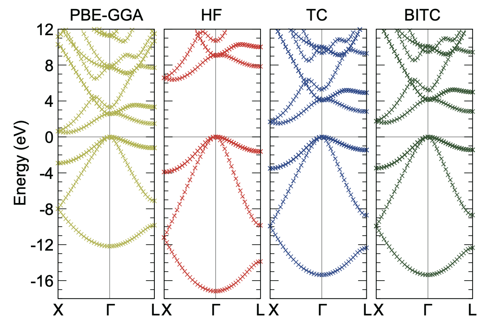

Tutorial
========

Bulk Silicon
------------

First, perform SCF calculation using Quantum Espresso (QE) with the following input file (e.g., ``scf.in``):

::

   &control
     prefix = 'prefix'
     calculation = 'scf'
     pseudo_dir = '/home/user/QE/pseudo_potential/'
     outdir = './'
     verbosity = 'high'
     disk_io = 'low'
   /
   &system
     ibrav = 2
     celldm(1) = 10.26
     nat = 2
     ntyp = 1
     nbnd = 10
     ecutwfc = 20.0
     occupations = 'fixed'
   /
   &electrons
     conv_thr = 1.0d-8
   /
   ATOMIC_SPECIES
     Si 1.0 Si.upf
   ATOMIC_POSITIONS {alat}
     Si 0.00 0.00 0.00
     Si 0.25 0.25 0.25
   K_POINTS {automatic}
      8 8 8 0 0 0

For running QE, please type
::

   $ pw.x < scf.in > scf.out

For more information about QE, please see the `QE website <https://www.quantum-espresso.org/>`_ and `keyword list <https://www.quantum-espresso.org/Doc/INPUT_PW.html>`_.
In this calculation, the Ne-core pseudopotentials of silicon [1]_ taken from `Pseudopotential Library <https://pseudopotentiallibrary.org/>`_ is placed in ``pseudo_dir`` specified above and named as ``Si.upf``.
Any calculation method in QE, such as DFT and HF, is acceptable as long as one can get one-elecron orbitals.
To obtain a band structure, we also need to perform band calculation using QE.

.. warning::

   For QE band-structure calculation, please copy the directory where QE SCF calculation was performed, and perform QE band calculation there.
   Namely, SCF and band calculations of QE should be performed in different directories (e.g., ``qescf`` directory and ``qeband`` directory).
   This is to prevent output files from being overwritten. Thus, if you explicitly specify different ``outdir``, you can use the same directory instead.
   
QE band calculation is performed with the following input file (e.g., ``band.in``):

::

   &control
     prefix = 'prefix'
     calculation = 'bands'
     pseudo_dir = '/home/user/QE/pseudo_potential/'
     outdir = './'
     verbosity = 'high'
     disk_io = 'low'
   /
   &system
     ibrav = 2
     celldm(1) = 10.26
     nat = 2
     ntyp = 1
     nbnd = 10
     ecutwfc = 20.0
     occupations = 'fixed'
   /
   &electrons
     conv_thr = 1.0d-8
   /
   ATOMIC_SPECIES
     Si 1.0 Si.upf
   ATOMIC_POSITIONS {alat}
     Si 0.00 0.00 0.00
     Si 0.25 0.25 0.25
   K_POINTS {crystal_b}
   3
    0.5 0.5 0.0 20
    0.0 0.0 0.0 20
    0.5 0.0 0.0 0

and type
::

   $ pw.x < band.in > band.out

Next, perform SCF calculation using TC++ with the following input file, ``input.in``,

::

   calc_method   HF  # change here for different methods (TC, BITC)
   calc_mode     SCF
   pseudo_dir    /home/user/QE/pseudo_potential
   qe_save_dir   /home/user/where_QE_SCFcalc_was_performed/prefix.save
   smearing_mode fixed

where ``pseudo_dir`` and ``qe_save_dir`` shoud be appropriately specified. Without MPI parallelization, simply typing
::

   $ ./tc++

will work if ``tc++`` is placed in this folder. However, we recommend to use MPI parallelization since this calculation requires :math:`O(1)` core hours for HF and :math:`O(10)` (- :math:`O(100)`) core hours for (BI)TC.
See :doc:`how_to_use` for more details about how to run TC++.
After SCF calculation, we should check whether '**convergence is achieved!**' is shown in ``output.out``.
If the convergence is not achieved, we can restart calculation using ``input.in`` with the following line added:

::

   restarts  true

However, it is often difficult to achieve convergence in BITC calculations.
While convergence can be improved by increasing the number of k-points and/or ``max_num_blocks_david`` in ``input.in``,
we did not do so in this tutorial.
To improve the convergence, it is also effective to reduce ``mixing_beta`` with ``mixes_density_matrix`` = true.
Band structures shown later were obtained without taking these ways or restarting calculation.

   Finally, we perform the band calculation.

.. warning::

   For TC++ band-structure calculation, please copy the directory where TC++ SCF calculation was performed and perform TC++ band calculation there.
   SCF and band calculations of TC++ should also be performed in different directories because the input and output file names, ``input.in`` and ``output.out``, are in common between two calculations.

Required ``input.in`` for band calculation is as follows,

::

   calc_method   HF  # change here for different methods (TC, BITC)
   calc_mode     BAND
   pseudo_dir    /home/user/QE/pseudo_potential
   qe_save_dir   /home/user/where_QE_BANDcalc_was_performed/prefix.save
   smearing_mode fixed

Note that ``qe_save_dir`` is different from that used in SCF calculation.
The band calculation requires ``tc_energy_scf.dat``, ``tc_wfc_scf.dat``, and ``tc_scfinfo.dat``, which were dumped in TC++ SCF calculation (see :doc:`how_to_use` for details). These files should be placed in the directory where TC++ band calculation runs. A command for running TC++ is the same as SCF: ``./tc++`` for non-MPI-parallelized calculation, but we strongly recommend to use MPI parallelization.

Users can apply ``restarts = true`` also for BAND calculation if necessary (e.g., when band calculation stops before convergence is achieved).
A small error will remain in these tutorial calculations of the TC and BITC methods, which can be reduced by increasing the number of k-points and/or
changing the choice of the band k-points (See :doc:`tips_and_faq`). The calculated band eigenvalues are dumped in ``tc_bandplot.dat``, as shown below (Note: PBE-GGA band structure was drawn using QE).

For plotting these band structures, we used **gnuplot** and type ``EF = 4.....`` (please fill in the value of the Fermi energy (EF) shown in ``tc_bandplot.dat``) and ``p 'tc_bandplot.dat' u 4:($5-EF) w linesp``.
Here, EF was subtracted from the band eigenvalues. When ``smearing_mode = fixed`` is used, EF is the valence-band maximum energy.
When ``smearing_mode = gaussian`` is used, EF is the chemical potential (Fermi level) used for the Gaussian smearing.

Users can also perform `fake`-SCF calculation, where SCF and BAND calculations are simultaneously performed by specifying the k-points with an appropriate weight.
For this purpose, please perform QE calculation using the following input file (for a :math:`4\times 4\times 4` k-mesh)

::

   &control
     prefix = 'prefix'
     calculation = 'scf'
     pseudo_dir = '/home/user/QE/pseudo_potential/'
     outdir = './'
     verbosity = 'high'
     disk_io = 'low'
   /
   &system
     ibrav = 2
     celldm(1) = 10.26
     nat = 2
     ntyp = 1
     nbnd = 10
     ecutwfc = 20.0
     occupations = 'fixed'
   /
   &electrons
     conv_thr = 1.0d-8
   /
   ATOMIC_SPECIES
     Si 1.0 Si.upf
   ATOMIC_POSITIONS {alat}
     Si 0.00 0.00 0.00
     Si 0.25 0.25 0.25
   K_POINTS {crystal}
   19
     0.0 0.0 0.0 0.03125
     0.0 0.0 0.25 0.25
     0.0 0.0 -0.5 0.125
     0.0 0.25 0.25 0.1875
     0.0 0.25 -0.5 0.75
     0.0 0.25 -0.25 0.375
     0.0 -0.5 -0.5 0.09375
     0.25 -0.5 -0.25 0.1875
     0.0 0.0 0.0 0.0
     0.05 0.0 0.0 0.0
     0.1 0.0 0.0 0.0
     0.15 0.0 0.0 0.0
     0.2 0.0 0.0 0.0
     0.25 0.0 0.0 0.0
     0.3 0.0 0.0 0.0
     0.35 0.0 0.0 0.0
     0.4 0.0 0.0 0.0
     0.45 0.0 0.0 0.0
     0.5 0.0 0.0 0.0

and then perform SCF calculation with TC++, which gives the SCF and BAND eigenvalues simultaneously.
However, we do not recommend this way by the following reasons: band eigenvalues are not checked for convergence in this calculation (see ``energy_tolerance``
in :doc:`input_in`), and computational cost becomes expensive because the computation time is proportional to the square of the number of k-points.
Note that ``tc_bandplot.dat`` is not dumped in the `fake`-SCF procedure since ``calc_mode = SCF``.
	   
.. [1] M. Chandler Bennett *et al.*, J. Chem. Phys. **149**, 104108 (2018).

Homogeneous Electron Gas
------------------------

TC++ also supports calculation of homogeneous electron gas.
First, perform SCF calculation using QE with the following input file,

::

   &control
     prefix = 'prefix'
     calculation = 'scf'
     pseudo_dir = '/home/user/QE/pseudo_potential/'
     outdir = './'
     verbosity = 'high'
     disk_io = 'low'
   /
   &system
     ibrav = 1
     celldm(1) = 7.67663317071 ! Bohr
     nat = 1
     ntyp = 1
     nbnd = 20
     ecutwfc = 20.0
     occupations = 'smearing'
     smearing = 'gauss'
     degauss = 0.03 ! Ry
   /
   &electrons
     conv_thr = 1.0d-8
   /
   ATOMIC_SPECIES
     Si 1.0 Si.upf
   ATOMIC_POSITIONS {alat}
     Si 0.00 0.00 0.00
   K_POINTS {automatic}
    12 12 12 0 0 0

where the pseudopotential file, ``Si.upf``, placed in ``pseudo_dir`` is used because calculation of homogeneous electron gas is not implemented in QE. Four valence electrons in the simple-cubic lattice with this lattice constant corresponds to the :math:`r_s` parameter of 3 Bohr in electron gas. For a band-structure plot, perform the band calculation using QE with the following input file,

::

   &control
     prefix = 'prefix'
     calculation = 'bands'
     pseudo_dir = '/home/user/QE/pseudo_potential/'
     outdir = './'
     verbosity = 'high'
     disk_io = 'low'
   /
   &system
     ibrav = 1
     celldm(1) = 7.67663317071 ! Bohr
     nat = 1
     ntyp = 1
     nbnd = 20
     ecutwfc = 20.0
     occupations = 'smearing'
     smearing = 'gauss'
     degauss = 0.03 ! Ry
   /
   &electrons
     conv_thr = 1.0d-8
   /
   ATOMIC_SPECIES
     Si 1.0 Si.upf
   ATOMIC_POSITIONS {alat}
     Si 0.00 0.00 0.00
   K_POINTS {tpiba_b}
   3
   -0.5 -0.5 -0.5 20
   0.0 0.0 0.0 20
   0.5 0.0 0.0 0

Then, perform SCF calculation using TC++ with the following ``input.in``,

::

   calc_method     FREE  # change here for different methods (HF, TC)
   calc_mode       SCF   # SCF or BAND
   pseudo_dir      /home/user/QE/pseudo_potential
   qe_save_dir     /home/user/where_QE_SCFcalc_was_performed/prefix.save
   smearing_mode   gaussian
   smearing_width  0.02  # in Ht.
   is_heg          true

and perform band calculation by changing ``calc_mode`` and ``qe_save_dir`` in the above ``input.in``.
Note that ``qe_save_dir`` in band calculation should be the directory where QE band calculation (not SCF!) was performed. The calculated band structures are shown below.

.. image:: ./HEG_bands.png
   :scale: 40%

One notable feature here is that the HF band structure has a well-known singularity at the Fermi energy: the density of states becomes zero at the Fermi energy with a logarithmic singularity.
This is due to a lack of the screening effect of the electron-electron interaction in the Hartree-Fock theory. As a result, the HF band structure is quite dispersive near the Fermi energy.
On the other hand, the TC band structure does not have this kind of unphysical behavior thanks to the Jastrow factor that includes the screening effect.
Note that BITC should offer the same result as TC because left and right one-electron orbitals are the same plane waves for homogeneous electron gas.

Users can use a different value for the lattice type, the atomic species, and the lattice constant. The subsequent TC++ run only uses the number of electrons and the periodic cell.
Since TC++ can use crystal symmetries existing in the QE input, high-symmetry structure is preferable for efficient computation.
